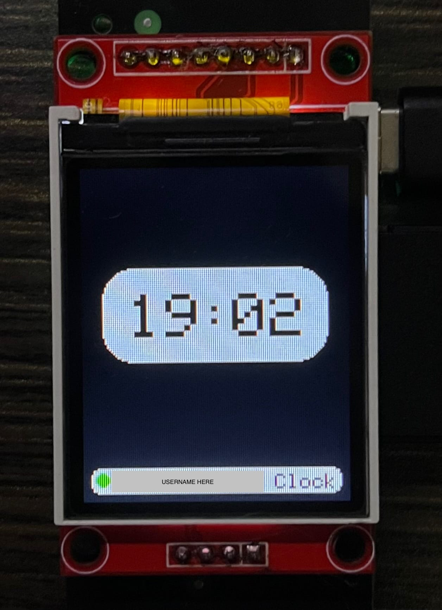

# 🔥 ESP32 Digital Frame With ST7735 1.8inch

**Microcontroller Supported**: ESP32 
**Author**: Javier Rayhan  
**Project Start**: November 2, 2024
**Status**: Stable, but open to improvements

---

## 📌 Project Description

This project is a special creation made with love and tech, a digital keepsake designed to celebrate graduation and create lasting memories for my friends and loved ones. It’s more than just electronics, it’s a symbol of connection, gratitude, and unforgettable moments.

As we step into the next chapter of our lives, **I wanted to leave behind something meaningful and personal**. This ESP32-based digital photo frame is my way of saying "thank you for being part of my journey", and making sure a part of me stays with the people who matter to me the most.
| Feature                     | Description                                                                                                    |
| --------------------------- | ---------------------------------------------------------------------------------------------------------------|
| 🖼️ **Digital Photo Frame**  | Displays rotating photos stored in flash memory — a gallery of memories.                                       |
| 🌐 **Wi-Fi Connectivity**   | Connects to the internet to sync time via NTP. Supports EEPROM-like SSID storage for flexible Wi-Fi switching. |
| 🕒 **Internet Clock**       | Always shows the accurate current time with auto-sync from internet servers.                                   |
| 🔊 **Simple Buzzer Sound**  | Plays a simple notification tone — adds a personal touch and interactivity.                                    |
| 💡 **Brightness Control**   | Adjust screen brightness to suit ambient lighting — eyes feel comfy anytime.                                   |
| 🌈 **WS2812 LED Effects**   | Colorful LED animations add visual flair and a bit of magic to the display.                                    |
| ⚠️ **Wi-Fi Indicator**      | Wi-Fi indicator, red for disconnect, green for connected                                                       |

###### This project uses an **SD card** to store up to 11 photos by default (based on the current code). Feel free to expand it however you want!

---

## 🧰 Hardware Components

| Component                  | Quantity | Notes                                                      |
| -------------------------- | -------- | ---------------------------------------------------------- |
| ESP32-WROOM                | 1        | Main microcontroller, Wi-Fi + Bluetooth onboard            |
| AMS1117 3.3V Regulator     | 1        | Converts 5V from USB to 3.3V for ESP32 and peripherals     |
| ST7735 1.8" TFT LCD        | 1        | Main display, SPI interface                                |
| MSKT-13C01 Switch          | 1        | Optional 3-position switch for boot/program mode           |
| W25Q EEPROM (e.g., W25Q64) | 1        | Optional, currently unused SPI EEPROM for future expansion |
| Buzzer (active)            | 1        | Optional, for audio feedback                               |
| 100nF Capacitor            | 2        | For voltage regulation stability                           |
| 10µF Capacitor             | 2        | For AMS1117 regulator input/output filtering               |
| Button (Tactile)           | 3        | Required for user interaction                              |
| USB Type-C Connector       | 1        | Optional, used to supply 5V to the circuit                 |
| 2-Pin Header               | 2        | For UART debugging connection (TX/RX)                      |

---

## 🔌 Wiring Schematic

  Pinout Source:  <a href="https://myhomethings.eu/en/esp32-pinout-which-pin-is-for-what/" target="_blank">
  myhomethings.eu, ESP32 PinOut – which pin is for what
  </a>

  Pinout Source:  <a href="https://www.instructables.com/Value-Your-Project-Use-Graphic-Display/" target="_blank">
  Instructables, Value Your Project: Use Graphic Display!
  </a>

| Component            | ESP32 Pin  | Description                                     |
| -------------------- | ---------- | ----------------------------------------------- |
| TFT LCD CS           | IO33       | Chip Select for ST7735 TFT                      |
| TFT LCD RST          | IO14       | Reset pin for TFT (optional)                    |
| TFT LCD DC (AO)      | IO26       | Data/Command pin for TFT                        |
| TFT LCD SCK          | IO18 (CLK) | SPI Clock line                                  |
| TFT LCD SDA (DIN)    | IO23 (SD0) | SPI MOSI / Data line for TFT                    |
| TFT LCD BLK          | IO0      | Backlight control for TFT                       |
| EEPROM CS            | IO4       | Chip Select for W25Q64 EEPROM                   |
| EEPROM SCK           | IO18 (CLK) | Shared SPI Clock (same as TFT)                  |
| EEPROM MISO          | IO19 (SD1) | SPI MISO line for EEPROM                        |
| EEPROM MOSI          | IO23 (SD0) | SPI MOSI line for EEPROM                        |
| RGB LED (WS2812B)    | IO25       | Data input for addressable RGB LED              |
| Buzzer               | IO12        | Output pin to active buzzer                     |
| Button SW0 (Pulldown)          | IO15       | Change menu, confirm              |
| Button SW1 (Pulldown)          | IO13       | Increase button                   |
| Button SW2 (Pulldown)          | IO27       | Decrease Button                   |
| USB Type-C Connector | -          | 5V power input via USB                          |
| Voltage Regulator    | -          | AMS1117-3.3 to supply 3.3V to ESP32 and modules |
| Debug TX             | IO1 (TXD0) | UART TX for debugging                           |
| Debug RX             | IO3 (RXD0) | UART RX for debugging                           |
| VCC (All modules)    | 3.3V   | Out Power supply lines                              |
| GND                  | GND        | Common ground                                   |

---

## 📺 Display Output Example

---

## ⚠️ Warning and Caution
**Do Not:**
1. Supply above 5V direct to ESP32
2. Short Circuit 
3. Mad if failed, it just matter of time

**Do:**
1. Have fun with your project!
2. Keep you body healthy :D
3. Patient 

### 🛠️Feel free to improve or tweak the code!
I totally welcome any modifications, fixes, or upgrades you wanna make. Just please give a little credit, something like:
**“Original firmware by Javier Rayhan on GitHub”**
…and we’re cool 😄